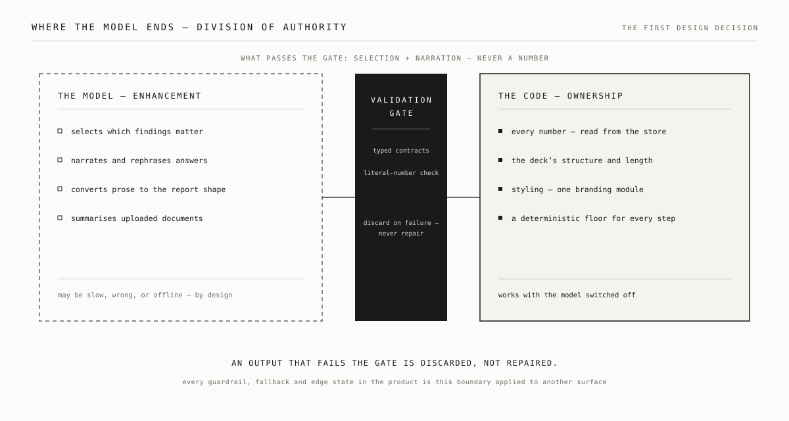
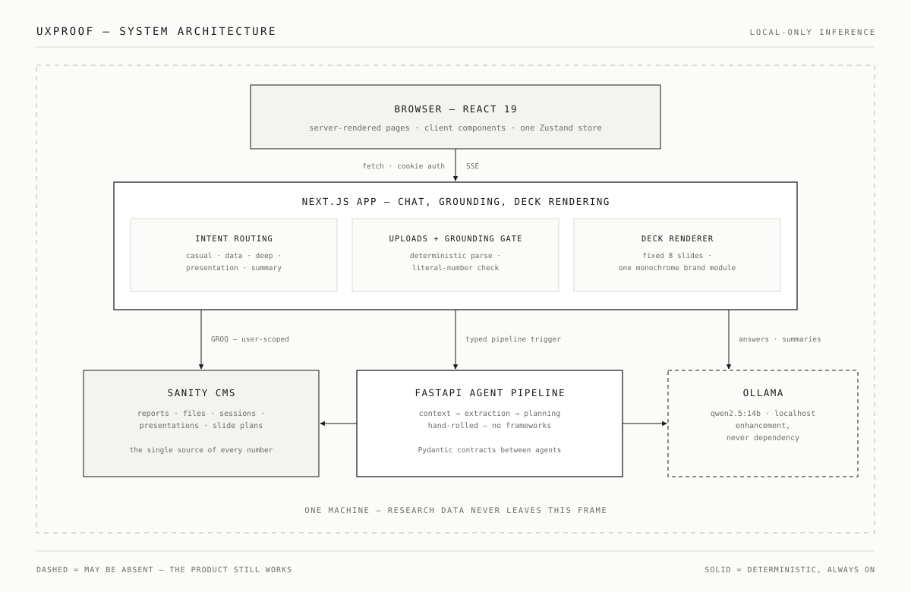

# uxproof

**Upload the research, talk to it, get the deck.** A chat-first AI tool by
Katarzyna Pilarz that turns uploaded UX research into client-ready,
monochrome 8-slide PowerPoint decks — every number grounded, every model
step backed by a deterministic fallback.

Ask in plain language — *"Analyse Q3 2025"*, *"Compare Q2 vs Q3"*,
*"Generate the 2025 presentation"* — and uxproof answers from **your
uploaded research only**, then renders a fixed-template `.pptx` deck on
demand.

## The trust boundary

The one rule that shapes everything: **the LLM never invents data.**

- The model may **select, narrate, and convert** — pick relevant findings,
  phrase answers, turn prose documents into the structured report shape.
- Code owns **every number, the slide structure, the styling, and
  availability.** Model-extracted numbers survive only if they appear
  literally in the source document (`next/src/lib/report-parsing.ts`);
  chat replies and summaries whose numbers can't be traced are discarded
  for their deterministic templates.
- **Every model step has a deterministic fallback** — with Ollama fully
  offline, decks still generate.

Inference is local-only (Ollama, default `qwen2.5:14b`): research data
never leaves the machine.



## How it works

1. **Sign in** — email + password (scrypt via `node:crypto`, HMAC-signed
   httpOnly cookie, users in Sanity). Create an account or sign in from the
   same screen; name, photo and password are editable later from the profile
   panel under the avatar.
2. **Upload** research files via the chat's **+** button (CSV, JSON, PDF,
   TXT, Markdown). Structured rows (quarter + year + SUS score) parse
   deterministically into user-owned `report` documents; prose documents
   are converted by the local model under the literal-value guardrail.
3. **Ask** — questions, comparisons, summaries; answers are built
   deterministically from your reports, optionally rewritten
   conversationally (numbers re-validated) by the local model.
4. **Generate** — a presentation card renders idle; on click, the FastAPI
   pipeline (Context → Extraction → Planning, hand-rolled, typed Pydantic
   contracts) builds a slide plan and pptxgenjs renders the deck.



## Architecture

| Directory | Stack | Role |
|---|---|---|
| [next/](next/) | Next.js 16, React 19, Tailwind 4, Zustand, pptxgenjs | Chat UI, API routes, deck renderer |
| [sanity-studio/](sanity-studio/) | Sanity Studio v5 | CMS: users, reports, files, sessions, intelligence, slide plans |
| [agent-service/](agent-service/) | FastAPI, Pydantic, Ollama | Context → Extraction → Planning pipeline (no orchestration framework) |

## The deck

The Dossier template: a **library of slide types, not a fixed run**. Cover,
contents, executive summary, study at a glance, section dividers, one slide
per finding, findings summary, task performance, SUS by participant, trend,
key indicators, recommendations, appendix. A slide is emitted only when the
data behind it exists, so a report of seven metrics yields a short honest
deck and a full study yields a long one — nothing is ever padded.

Ground `#F3F2F2`, ink `#201E1D`, a single violet accent `#6D4AF5`, Schibsted
Grotesk with IBM Plex Mono for uppercase chrome, corner radius 0 everywhere,
at most one violet figure per slide. Photographs are greyscale — the app
converts an uploaded one in the browser before it is stored. The single
source of truth is
[next/src/lib/branding/brand.ts](next/src/lib/branding/brand.ts); which
slides exist is decided in
[next/src/lib/ppt/deck-data.ts](next/src/lib/ppt/deck-data.ts). Neither
layout nor structure passes through the model, so the deck cannot drift.

The uxproof mark appears on the cover and section dividers, drawn as shapes
so it stays vector. The **app UI** keeps its own violet accent, separate
from the deck's.

## Running locally

```bash
# Next.js app (port 3000)
cd next && npm run dev

# Agent service (port 8001) — venv .venv, requirements.txt
cd agent-service && uvicorn main:app --port 8001

# Sanity Studio (port 3333)
cd sanity-studio && npm run dev
```

Copy each service's `.env.example` and fill in the Sanity API token
(env-only, never committed). Ollama runs locally at `localhost:11434`.

## Tests

```bash
cd next && npm test
```

The suite covers the trust boundary: the structured-parse acceptance gate,
the number-grounding guardrail (including its deliberately conservative
false-negative bias), truncated-model-reply salvage, and the summary
guardrail with its deterministic fallback.

## Data notes

- **All research data is user-uploaded** — there is no global dataset. A
  user with no data is asked to upload, never shown someone else's numbers.
- `sanity-studio/seed-reports.ndjson` is a 100% fictional demo dataset
  (client "Aurelo"); seeded reports carry no owner, so the per-user app
  ignores them. `npm run purge:global-data` (from `next/`) removes them.
